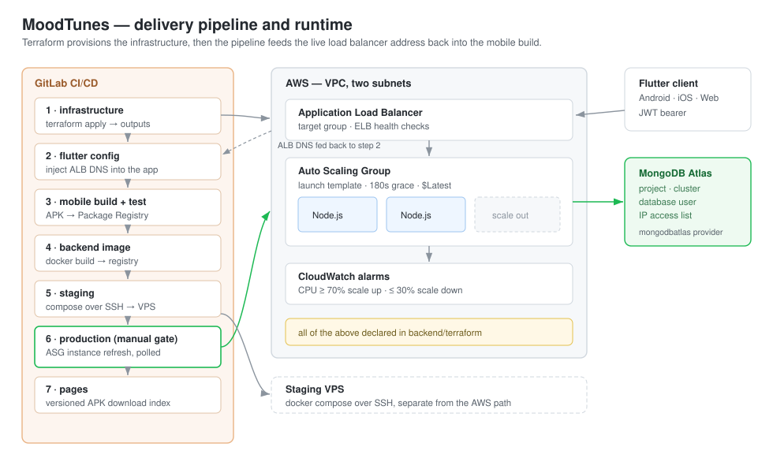

# 🎵 MoodTunes - Music Mood Journal

A Flutter + Node.js + MongoDB mood journal: log how you feel, attach the song you were listening
to, and watch the patterns build up over time.

**The application is the test subject, not the point.** It exists to give the infrastructure
something real to carry — a mobile client that has to be built and distributed, a stateful backend
that has to scale, and a managed database that has to be provisioned. What this repository is
actually about is everything underneath that.

The pipeline closes a loop most projects leave open: `terraform apply` creates the load balancer
and hands its DNS name back as an output, the pipeline writes that name into the Flutter app's
config, and only then is the APK built. The app never contains a hardcoded endpoint, so the entire
network layer can be destroyed and rebuilt without editing a line of Dart. Production releases go
out as an Auto Scaling Group instance refresh behind a manual gate, polled until the fleet has
turned over.



## ✨ Features

- **8 Mood Types**: Happy, Sad, Energetic, Calm, Angry, Anxious, Romantic, Nostalgic
- **Mood Intensity Scale**: Rate your mood from 1-10
- **Song Tracking**: Link songs (title + artist) to each mood entry
- **Personal Notes**: Add context to your mood entries
- **Statistics Dashboard**: 
  - Mood distribution pie chart
  - Top songs per mood
  - Daily streak tracking
  - Average mood score
- **Spotify-Inspired UI**: Dark theme with green accents (#1DB954)
- **User Authentication**: Secure login/registration with JWT
- **Cross-Platform**: Works on Web, Android, iOS

## 🛠️ Tech Stack

### Infrastructure and delivery — where the work is
- **Terraform** - VPC, subnets, security groups, ALB, launch template, Auto Scaling Group, CloudWatch alarms
- **MongoDB Atlas** - provisioned through the `mongodbatlas` provider, not clicked together by hand
- **AWS** - ALB with ELB health checks, ASG across two availability zones, EC2
- **GitLab CI/CD** - seven stages, Terraform outputs passed forward as artifacts, manual production gate
- **Docker** - backend image built in CI and pulled by instances at boot
- **GitLab Pages + Package Registry** - versioned APK distribution

### Backend
- **Node.js** / **Express.js** - REST API
- **MongoDB** - document store
- **bcrypt** - password hashing
- **JWT** - authentication tokens

### Frontend
- **Flutter** - Android, iOS and Web from one codebase
- **fl_chart** - statistics charts
- **Google Fonts** - Poppins typography
- **JWT Decoder** - token handling

## 📁 Project Structure

```
├── backend/                # Node.js + Express
│   ├── model/              # MongoDB schemas (MoodEntry, User)
│   ├── controller/         # Request handlers
│   ├── services/           # Business logic
│   ├── router/             # API routes
│   ├── terraform/          # AWS + MongoDB Atlas infrastructure
│   │   ├── alb.tf          # Load balancer and target group
│   │   ├── autoscaling.tf  # Launch template, ASG, scaling policies, alarms
│   │   ├── atlas.tf        # Atlas project, cluster, user, IP access list
│   │   └── main.tf         # VPC, subnets, security groups
│   └── Dockerfile
├── frontend/               # Flutter
│   ├── lib/
│   │   ├── main.dart       # App entry point
│   │   ├── loginPage.dart  # Login screen
│   │   ├── registration.dart
│   │   ├── dashboard.dart  # Main mood journal
│   │   └── config.dart     # API endpoints, written by CI
│   └── pubspec.yaml
└── .gitlab-ci.yml          # Seven-stage pipeline
```

## 🚀 Getting Started

### Prerequisites
- Flutter SDK (3.0+)
- Node.js (16+)
- MongoDB
- Docker (optional)

### Backend Setup
```bash
cd MoodTunes_Backend
npm install
node index.js
```

### Frontend Setup
```bash
cd moodtunes_frontend
flutter pub get
flutter run -d chrome  # or android/ios
```

## 📊 Database Schema

### MoodEntry Collection
```javascript
{
  userId: ObjectId,
  mood: String,           // happy, sad, energetic, etc.
  moodScore: Number,      // 1-10
  song: {
    title: String,
    artist: String,
    albumArt: String,
    spotifyUrl: String
  },
  note: String,
  date: Date,
  createdAt: Date,
  updatedAt: Date
}
```

## 🎨 Color Palette

- Background: `#121212`
- Surface: `#1E1E1E`
- Primary: `#1DB954` (Spotify Green)
- Secondary: `#1ED760`
- Text: `#FFFFFF`

## 📱 Getting the app

Every pipeline run publishes a signed APK to the GitLab Package Registry, and the `pages` stage
rebuilds an index listing every version in descending order — so any build is downloadable without
digging through job artifacts.

## 🔧 API Endpoints

```
POST /registration          # Create account
POST /login                 # User login
POST /createMoodEntry       # Log mood + song
POST /getMoodEntries        # Get user's moods
POST /getMoodStats          # Get statistics
POST /deleteMoodEntry       # Delete entry
POST /getEntriesByMood      # Filter by mood type
```

## 🌐 Deployment

Seven stages in `.gitlab-ci.yml`:

| Stage | What happens |
|---|---|
| `infrastructure` | `terraform apply`, exporting the ALB DNS name, ASG name and Atlas connection details as job artifacts |
| `flutter_config` | Rewrites the app's `config.dart` with the ALB DNS from the previous stage |
| `mobile_build` | Builds the Android APK and publishes it to the GitLab Package Registry |
| `test` | Runs the Flutter test suite with coverage |
| `backend_build` | Builds and pushes the backend image |
| `staging` | Deploys to a VPS over SSH with Docker Compose |
| `production` | Manual gate, then an ASG instance refresh with a rolling strategy, polled to completion |
| `pages` | Publishes an index of every APK version from the registry |

Because the app's API endpoint comes from a Terraform output rather than a hardcoded constant, the
load balancer can be destroyed and rebuilt without touching application code.

Infrastructure is declared across `alb.tf`, `autoscaling.tf`, `atlas.tf` and `main.tf`. Scaling is
driven by CloudWatch CPU alarms at 70% and 30% with 300-second cooldowns, and the ASG uses ELB
health checks so an instance failing HTTP is replaced rather than merely restarted.

## 📄 License

MIT License
